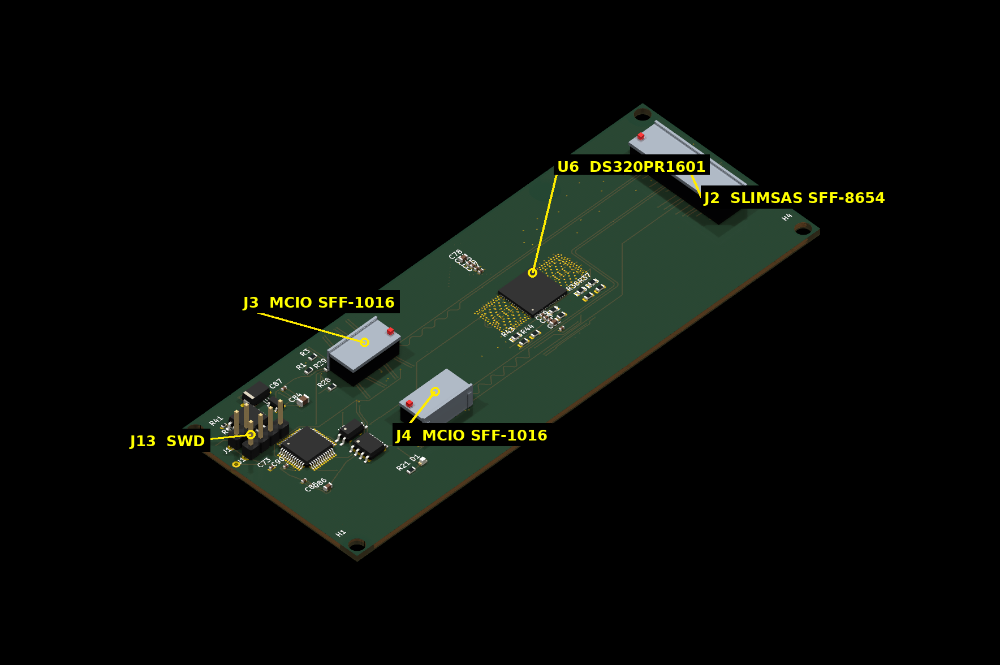

# hw_ic_k2 — K2 PCIe Gen4 Converter Card (x8 → 2× x4)

**English** | [简体中文](README.zh-CN.md)

Open-source hardware — KiCad design files for the **K2 converter card**, the
worker-side data-plane card in the IOCONVERT V2.0 1-Master-to-4-Worker chained
NTB cluster. It takes one x8 host link and fans it out to two x4 MCIO ports,
redriven for PCIe Gen4 signal integrity.

## Preview

**Current fabrication release (`m7t8a`)** — annotated 3D render (connector entry
directions, pin-1 markers and part labels verified against the board):



Board file: `pm_gate/artifacts/k2_v4/L6/board/k2_v4_8L.m7t8a.kicad_pcb`

*3D renders use KiCad stock models for standard packages. The MCIO (SFF-1016) and
SlimSAS (SFF-8654) connectors have no vendor 3D models and are represented by
simplified models derived from their footprint geometry (entry direction and
pin-1 markers placed per footprint placement).*

## Overview

K2 sits between the master host and the worker devices. A single SlimSAS x8
uplink carries eight PCIe Gen4 lanes; the card redrives them (per-lane AC
coupling is integrated in the device), then splits them across two MCIO 4i
downlinks (4 lanes each). A single DS320PR1601 redriver (U6) handles the link,
and an on-board STM32G0B1 MCU manages sideband, out-of-band UART, I2C and the
FRU EEPROM.

```
                8 lanes                       2 × 4 lanes
  Master ─────────────────►  K2  ──────────────────────────► MCIO 4i (J3) → worker
  (SlimSAS x8,              │    AC coupling + redrive
   SFF-8654, J2)            └──────────────────────────────► MCIO 4i (J4) → worker

                            U6 = DS320PR1601 redriver
                            STM32G0B1 MCU · 12V DC-in
```

## Key Features

- **Form factor**: 8-layer PCB, 120 × 46 mm, 85Ω ±10% differential impedance
- **Uplink**: 1× SlimSAS x8 (SFF-8654) — 8 PCIe Gen4 lanes + 2 reference clocks
- **Downlink**: 2× MCIO 4i (SFF-1016) — the x8 link is bifurcated into 2× x4
- **Redrivers**: single DS320PR1601 (U6); per-lane AC coupling is integrated in the device
- **Management**: STM32G0B1 MCU — sideband, OOB UART, I2C, FRU EEPROM
- **Power**: 12V DC-in → DC-DC 5V → LDO 3V3, plus 3.3V_AUX
- **Debug**: SWD header (J13), OOB UART header (J9)

## Repository Contents

| Path | Description |
|---|---|
| `hw/` | KiCad project (current 8L revision) |
| `hw/sch/` | Schematics: connectors, AC-coupling & ReDriver strap (up/down), MCU & sideband, power |
| `hw/lib/` | Symbol + footprint libraries |
| `hw/data/` | Netlist / project configuration (YAML) |
| `archive/k2_v4_6L/` | Historical 6L revision (superseded by 8L) |
| `docs/` | Architecture and manufacturing notes |

## Getting Started

1. Install [KiCad](https://www.kicad.org/) 10.x
2. Clone this repository
3. Open `hw/k2_v4_8L.kicad_pro`
4. If symbols/footprints show as missing, add `hw/lib/DS320PR1601.kicad_sym` to
   the symbol library table and `hw/lib/ForgeOS.pretty/` to the footprint
   library table (global or project-level)

## Key Files

| File | Meaning |
|---|---|
| `hw/k2_v4_8L.kicad_pcb` | **Design source** (frozen input) |
| `pm_gate/artifacts/k2_v4/L6/board/k2_v4_8L.m7t8a.kicad_pcb` | **Fabrication release board** (ready to order) |

## Documentation

- [`docs/01-architecture.md`](docs/01-architecture.md) — What this card is
- [`docs/02-manufacturing.md`](docs/02-manufacturing.md) — Stackup / process / delivery

## License

AGPL-3.0 (see `LICENSE`)

---

*Part of the IOCONVERT V2.0 family: [hw_ic_k1](https://github.com/dataxcash/hw_ic_k1) (master gate card) · [hw_ic_key](https://github.com/dataxcash/hw_ic_key) (secure key vault)*
