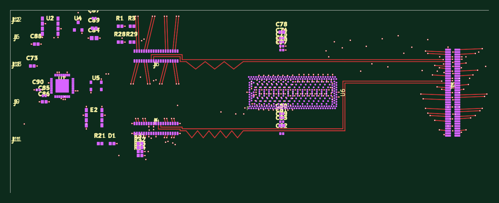
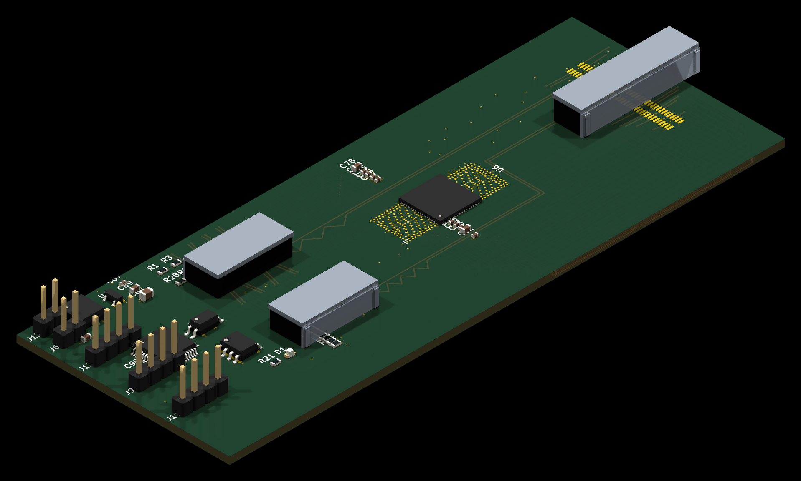
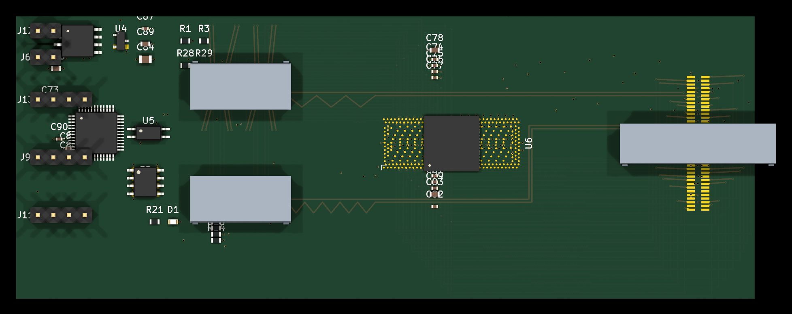

# hw_ic_k2 — K2 PCIe Gen4 转换卡（x8 → 2× x4）

[English](README.md) | **简体中文**

开源硬件 —— **K2 转换卡**的 KiCad 设计文件。K2 是 IOCONVERT V2.0「1 主控 → 4 工卡」
链式 NTB 集群中的**工卡侧数据面卡**：一路 x8 主机链路进来，经信号中继后扇出为
两路 x4 MCIO 端口。

## 预览

施工交付板（`hw/k2_v4_8L.l4.kicad_pcb`，120 × 46 mm）顶视图：







*3D 渲染对标准封装使用 KiCad 官方模型；MCIO（SFF-1016）与 SlimSAS（SFF-8654）连接器无厂商 3D 模型，由封装几何自建的简化模型代替。*

## 概述

K2 位于主控主机与工卡设备之间。一路 SlimSAS x8 上行承载 8 条 PCIe Gen4 通道；
本卡做 AC 耦合 + 中继，再拆成两路 MCIO 4i 下行（每路 4 通道）。**两个方向各用
一颗 DS160PR810 做中继**；板载 STM32G0B1 MCU 负责边带、带外 UART、I2C 与 FRU EEPROM。

```
                8 通道                        2 × 4 通道
  主控 ─────────────────►  K2  ──────────────────────────► MCIO 4i (J3) → 工卡
  (SlimSAS x8,              │    AC 耦合 + 中继
   SFF-8654, J2)            └──────────────────────────────► MCIO 4i (J4) → 工卡

                            U7 上行 / U3 下行
                            STM32G0B1 MCU · 12V DC-in
```

## 主要特性

- **形态**：8 层板，120 × 46 mm，差分阻抗 **85Ω ±10%**
- **上行**：1× SlimSAS x8（SFF-8654）—— 8 条 PCIe Gen4 通道 + 2 路参考时钟
- **下行**：2× MCIO 4i（SFF-1016）—— x8 拆分为 2× x4
- **中继**：双 DS160PR810（U7 上行 / U3 下行），逐通道 AC 耦合
- **管理**：STM32G0B1 MCU —— 边带 / 带外 UART / I2C / FRU EEPROM
- **供电**：12V DC-in → DC-DC 5V → LDO 3V3，另有 3.3V_AUX
- **调试**：SWD 排针（J13）、带外 UART 排针（J9）

## 目录导航

| 目录 | 内容 |
|---|---|
| `hw/` | **KiCad 工程（当前版 8L）** |
| `hw/sch/` | 原理图：连接器 / AC 耦合与 ReDriver 配置（上·下行）/ MCU 与边带 / 电源 |
| `hw/lib/` | 符号库 + 封装库 |
| `hw/data/` | 网表 / 工程配置（YAML） |
| `archive/k2_v4_6L/` | 历史 6L 版（已被 8L 取代） |
| `docs/` | 架构与制造说明 |

## 打开方式

1. 安装 [KiCad](https://www.kicad.org/) 10.x
2. 克隆本仓库
3. 打开 `hw/k2_v4_8L.kicad_pro`
4. 若提示符号/封装缺失：把 `hw/lib/DS320PR1601.kicad_sym` 加进符号库表，
   把 `hw/lib/ForgeOS.pretty/` 加进封装库表（全局或工程级均可）

## 关键文件

| 文件 | 含义 |
|---|---|
| `hw/k2_v4_8L.kicad_pcb` | **设计源**（冻结输入） |
| `hw/k2_v4_8L.l4.kicad_pcb` | **施工交付板**（可打样） |

## 文档

- [`docs/01-architecture.zh-CN.md`](docs/01-architecture.zh-CN.md) — 这是什么卡
- [`docs/02-manufacturing.zh-CN.md`](docs/02-manufacturing.zh-CN.md) — 叠层 / 工艺 / 交付

## 许可

AGPL-3.0（见 `LICENSE`）

---

*IOCONVERT V2.0 家族成员：[hw_ic_k1](https://github.com/dataxcash/hw_ic_k1)（主控门禁卡）· [hw_ic_key](https://github.com/dataxcash/hw_ic_key)（安全钥）*
